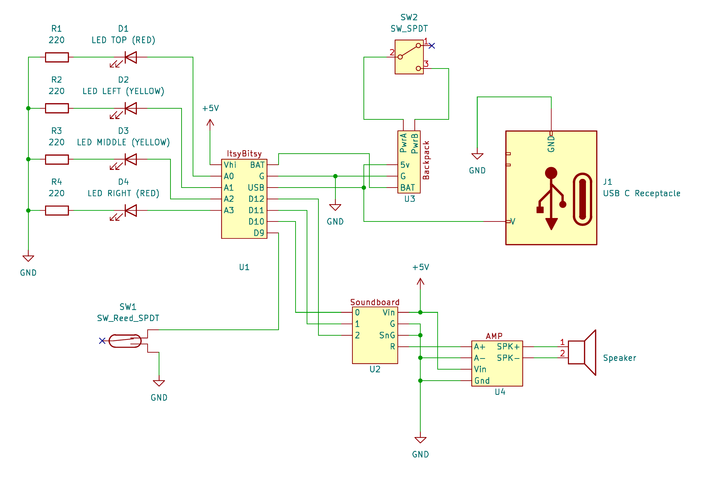

### The Mighty Jabba Asks Why He Must Pay Fifty Thousand.

### Because He’s Holding a Thermal Detonator!
[More photos…](#gallery-section)

---

This repository documents the **Star Wars thermal detonator** designed and assembled by [Tim Byrne](https://github.com/TheLocehiliosan) and [Bill Nedrow](https://www.amazon.com/stores/author/B00LI2PN5Q).  

The model is a modified version of the one published by [Roel Veldhuyzen on Thingiverse](https://www.thingiverse.com/thing:2065383).

The original model exposes 4 LEDs, with the sliding switch controlling power to the microcontroller that lights the LEDs.

We wanted a couple of improvements:
1. The iconic sound from the scene in *Return of the Jedi*.
2. The ability to recharge the battery without disassembling the model.

---

## 📦 Parts List
| Component | Description | Link |
|-----------|-------------|------|
| Battery | 3.7V 500mAh LiPo (larger) | [Adafruit](https://www.adafruit.com/product/1578) |
| Battery | 3.7V 350mAh LiPo (smaller) | [Adafruit](https://www.adafruit.com/product/2750) |
| LiPoly Backpack | Adafruit Pro Trinket LiPoly/LiIon Backpack | [Adafruit](https://www.adafruit.com/product/2124) |
| Microcontroller | Adafruit ItsyBitsy 32u4 3V | [Adafruit](https://www.adafruit.com/product/3675) |
| Sound Board | Adafruit Audio FX Mini Sound Board | [Adafruit](https://www.adafruit.com/product/2342) |
| Audio Amp | Adafruit Mono 2.5W Class D Audio Amplifier | [Adafruit](https://www.adafruit.com/product/2130) |
| Speaker | 8Ω 0.25W Speaker | [Adafruit](https://www.adafruit.com/product/1891) |
| USB-C Port | USB 3.1 Type C Socket | [Amazon](https://www.amazon.com/dp/B09WCSF8FC) |
| Power Switch | SS12D00G SPDT Slide Switch | [Amazon](https://www.amazon.com/SPDT-Mini-Micro-Slide-Switch/dp/B0DN69PJ43) |
| Reed Switch | Magnetic Reed Switch | [Amazon](https://www.amazon.com/dp/B0CW9418F6) |

---

## 🖨️ Model Printing & Painting
The model was printed on a **Creality Ender 3**.  
The original model is from [Thingiverse](https://www.thingiverse.com/thing:2065383).  
We enlarged the LED holes with a **3/16" drill bit** to fit 5mm LEDs.  
The bottom was modified to add holes for the power switch and USB-C charging port.  
Download the [modified bottom mesh here](freecad/bottom-v1.2.stl).

**Print Times:**
- Bottom (modified): 9h 1m
- Top: 7h 21m
- Cap: 5m
- Stand: 1h 51m
- Switch: 1h 25m

**Paints & Primers Used:**
- Rust-Oleum Automotive Primer
- Rust-Oleum Painters' Touch Ultra Cover Black
- Dupli-Color Perfect Match Universal Silver Metallic
- Rust-Oleum American Accents Gloss Red
- Dupli-Color Perfect Match Clear Coat

---

## 🔌 Circuit Design
  
*Unused pins are omitted for clarity.*

---

## 💻 Software
The reed switch is connected to **PIN 9** and uses the microcontroller’s internal pull-up resistor.  
When the button cover is removed (reed switch closed), the detonator is **armed**.

**When armed:**
- Sound activates
- Button LED blinks randomly
- First two LEDs count 1, 2, 3 in binary (increasing speed)
- Last LED flashes (increasing speed)

📄 [View full Arduino sketch](sketches/thermdet/thermdet.ino)

---

## 🔊 Sound Design
The detonator sound was isolated from the film and split into three WAV files:
1. Initial arming sound
2. Looping siren (4 iterations to minimize gaps)
3. Disarming sound

The Adafruit FX Mini Sound Board loops WAV files with minimal gaps, but we used four iterations for smoother playback.

---

## 🛠️ Assembly Notes
- The **reed switch** is fragile (glass). It was glued near the slide switch, and wires were soldered after placement.
- A small magnet was glued into the sliding switch to activate the reed switch.
- PCBs were stacked compactly using headers.
- Everything fits snugly inside the printed shell.

---

## 📸 Gallery

<video src="https://github.com/user-attachments/assets/ce40912a-d3ca-4933-8a3a-79745f3d9a88" controls width="600"></video>
